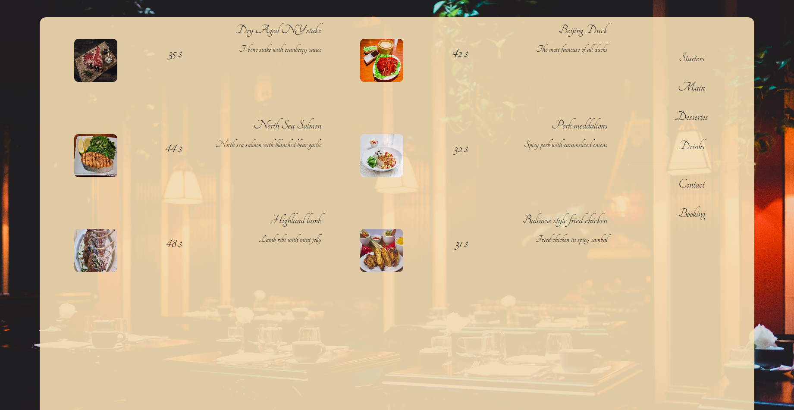
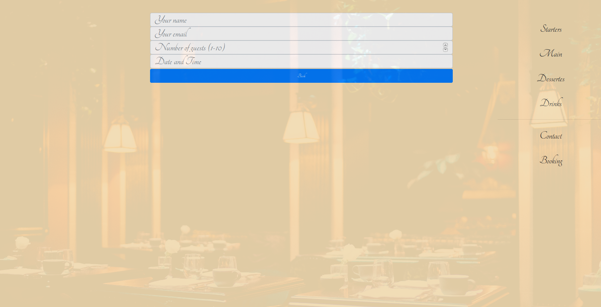

#### The Restaurant ,

> This is a minimalistic desing restaurnat web presentation including reservation form.

      *Presentation has been built using node as a server and webpack for assests menagment.*

> Booking Form

Web pages were dynamically created with JS functions that were recieving an objects and extracting their values to HTML. For styling purposes CSS as the ouyput SCSS as input was used in most of the cases, with exceptions of few lines from Bootstrap.

#### To run this project locally please follow these steps:

Clone the project from github with `git clone`

Run `npm install` to install all modules and dependencies

Run `npm run server`  to actually run the app. And Voila :) 

Feel free to fork, comment, suggest..... 
